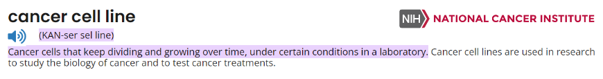

# F1L Internship Emulator - personal memo 📝

As introduced in [Dean Lee's linkedin newsletter](https://www.linkedin.com/pulse/introducing-f1l-internship-emulator-dean-lee-xckee/), the F1L Internship Emulator is an example of computational bio (intern) work in biotech/pharma. Following the recommendation of the author in [the first week's atricle](https://www.linkedin.com/pulse/week-1-f1l-internship-emulator-ksq-dean-lee-354ke/?trackingId=7%2BNj91jVSHm3z92bY3RYIg%3D%3D), this will be a documentation of my progress in the F1L project.

Table of contents:
- [F1L Internship Emulator - personal memo 📝](#f1l-internship-emulator---personal-memo-)
  - [Week 1: The Key Scientific Question 🔎](#week-1-the-key-scientific-question-)
    - [Terms \& Concepts: 🗒️](#terms--concepts-️)
    - [Data \& code: 📊](#data--code-)
    - [Findings \& Insights: 🧠](#findings--insights-)
    - [References: 📚](#references-)

## Week 1: The Key Scientific Question 🔎

***The KSQ: Using available scRNA-seq data from cancer cell lines, how would you explore the use of the following FDA-approved antibody therapies in additional cancers?***

### Terms & Concepts: 🗒️  

**scRNA-seq**:  
single-cell RNA sequencing, technique used to quantify gene expression levels of cells, where unlike bulk RNA-seq, the samples are _cells_, the feature are genes. The data is processed into a matrix of cells x genes. It allows for cell to cell comparison by highlighting the differences between a population of cells. This has won Nature method of the year in 2013.  
* Workflow:
  * cell isolation
  * extraction of the genetic matrial + amplification
  * library prep
  * sequencing (NGS)
  * analysis (QC, alignment, quantification, normalization, clustering, etc.)
Uses:
* Allow identification of cell types that are involved in a particular disease
* The heterogenity of cells allows the identification of rare cell types 
* Identification of expression patters of genes among cells -> gene co-regulated modules -> GRN between cells
* PCA for cell subpopulations identification 
* Cancer cell lines (?)  
  
HCA: Human Cell Atlas, a global effort to map all cells in the human body. This would form a reference map - like the Human Genome Project did for the genome. Fully released biological networks for the lungs and brain are out on the [data portal](https://data.humancellatlas.org/), and efforts are still being done until the whole organism is mapped. Works are now on 18 biological networks. Each network is a group aiming to form the map for a specific organ/system/tissues as a step towards the ultimate goal of creating a human reference map. On the data portal, each project contains the raw sequencing data + associated files + metadata (cell type, seq details...).

Analysis: tools known for scRNA-seq analysis are: [Seurat R package](https://satijalab.org/seurat/), [Scanpy python toolkit](https://scanpy.readthedocs.io/en/stable/)
* Preprocessing: as is the case in sequencing data in general and common with bulk RNA-seq we have teh following preprocessinf steps:
* QC: quality control, to remove low quality cells. Known tools are FastQC and trimmomatic
    * Alignment: mapping the reads to the reference genome. e.g., STAR, HISAT2
    * Filtering (?)
    * Quantification: turn it into counts of reads per gene. e.g., featureCounts
  * Normalization: taking into consideration library size and sequencing depth
  * DEA: identify differential expression between cell groups - e.g., DESeq2
  * Clustering: grouping based on gene expression patterns, unsupervised machine learning can be performed using Seurat functions
  * Visualization: using dimentionality reduction techniques like PCA, t-SNE, UMAP

**Cancer cells**: 
When things go wrong, normal cells transform into cancer cells that are able to proliferate rapidly. Usually it can be caused due to mutations in:  
* Tumor suppressor genes: genes that prevent cell division, allow cell death, repair DNA... When there is a mutation, the products of these genes (proteins) will lose their functionality => no more brakes on cell division.
The two hit hypothesis: a cell needs two mutations in a tumor suppressor gene to become cancerous. Why two? for both alleles to be turned off (one mutation is like having one out of 2 brakes broken).
_e.g., BRCA1, BRCA2. These are eventually translated into proteins that repair DNA_   
* Oncogenes: to define them would need to know about a _proto-oncogene_ which is a gene that is involved in cell growth and division. When a proto-oncogene mutates, it becomes an oncogene that can cause cells to grow and divide uncontrollably (like being turned on all the time). This will lead to cancer. First oncogene discovered is in Sarcoma (a type of cancer) and is called _SRC_, when mutated it gets over expressed.  

It's worth noting that not all mutations have effects, we have: silent mutations, missense mutations, nonsense mutations, frameshift mutations, etc.  
Common cancer characteristics that allow spreading in different cancer types are called cancer hallmarks (~10), which work for:  
* Mutation of its own genetic material: can change cellular makeup to resist and survive - change DNA (property that normal cells dont really have) (this one is called genome instability and mutation)
* Cell division: allow proliferation by being unchecked, sustain signals - cancer cells keep proliferating (3 hallmarks)
  * Evasion of growth suppressors: escape and keep on dividing 
  * Enable replicative immortality: keep on dividing without dying (immortal)
  * Dyregulating cellular energetics: change the way they get energy (aerobic glycolysis)
* Spreading disease: (2 hallmarks)
  * Inducing angiogenesis: make blood vessels grow towards them to get nutrients. Blood vessels spread all around body for the purpose of spreading nutrients, moving cells... Cancer cells use them to spread
  * Activation of invasion: invasion is moving from one tissue to another, usually normal cells stay in their place - not tha case in cancer cells. They can move to other tissues and start growing there.
* Escape normal body defense mechanisms:
  * Resistsing cell death: resist the mechanisms to grow
  * Avoid immune destruction: can not be recognized by immune systems (immune system is supposed to recognize and kill cancer cells)
* Tumor promoting inflamation: (inflamation is body repsonse to disease), cancer cells can use this inflamation to grow, they use the inflamation and take advantage of it  

Research aims to find ways to target these hallmarks to stop cancer growth.

Neoplasia is the abnormal growth of cells, it can be benign or malignant. In short benign is not cancerous and malignant is cancerous. Normal tissue have a particular order (epithelial => basement => blood/lumph vessels).  
* _Dysplasia_: losing this order and becoming disorganized.
* _Preinvasive carcinoma_: when cells start to invade and take the whole layer (p.s. carcinoma = cancer of the epithelium).  
* _Invasive carcinoma_: when cells start to bottom layer => basement membrane, get to vessels.  
* _Metatstatic carcinoma (metastasis)_: when cells start to spread to other tissues.

Now metastasis (last step of its progression) is the most dangerous part of cancer, it's when cells start to spread to other tissues. It's the most dangerous because it's hard to treat, detect, remove. Also found in important and vital organs. They can metastsize in different ways:  
- lymphatic spread: spread through lymphatic system
- hematogenous spread: spread through blood vessels

They can spread to cavities, bones, brain, liver, lungs, lymph nodes, peritoneum, pleura, skin, soft tissues, etc. difficult to know where its going through these routes. There are several steps to be achieved for a cell to metastasize. it can be local (same organ) or distant (other organ).  

_What's metastatic tropism?_  
It's the ability of cancer cells to spread to specific organs. It's not random, it's specific. It's not clear why it happens, but it's known that some cancers have a preference to spread to specific organs.


**Cancer Cell Lines**:

<p align='center'>

</p>

Cancer cell lines are cells that are grown in a lab, they are immortalized and can be used for research. They are used to study cancer biology, drug discovery, and personalized medicine. They are used to study the biology of cancer, to test drugs...

NCI-60 is a panel of 60 human cancer cell lines, a project released by NCI for 60 cell lines (involving 9 cancers) to be used for drug screening => generated the "most extensive cancer pharmacology database in the world".

[This is a list of the 60 human cancer cell lines used in the screen and maintained at NCI-Frederick. - NIH](https://dtp.cancer.gov/discovery_development/nci-60/cell_list.htm)  

| Cell Line Name        | Panel Name            | Doubling Time | Inoculation Density |
|-----------------------|-----------------------|---------------|---------------------|
| CCRF-CEM              | Leukemia              | 26.7          | 40000               |
| HL-60(TB)             | Leukemia              | 28.6          | 40000               |
| K-562                 | Leukemia              | 19.6          | 5000                |
| MOLT-4                | Leukemia              | 27.9          | 30000               |
| RPMI-8226             | Leukemia              | 33.5          | 20000               |
| SR                    | Leukemia              | 28.7          | 20000               |
| A549/ATCC             | Non-Small Cell Lung   | 22.9          | 7500                |
| EKVX                  | Non-Small Cell Lung   | 43.6          | 20000               |
| HOP-62                | Non-Small Cell Lung   | 39            | 10000               |
| HOP-92                | Non-Small Cell Lung   | 79.5          | 20000               |
| NCI-H226              | Non-Small Cell Lung   | 61            | 20000               |
| NCI-H23               | Non-Small Cell Lung   | 33.4          | 20000               |
| NCI-H322M             | Non-Small Cell Lung   | 35.3          | 20000               |
| NCI-H460              | Non-Small Cell Lung   | 17.8          | 7500                |
| NCI-H522              | Non-Small Cell Lung   | 38.2          | 20000               |
| COLO 205              | Colon                 | 23.8          | 15000               |
| HCC-2998              | Colon                 | 31.5          | 15000               |
| HCT-116               | Colon                 | 17.4          | 5000                |
| HCT-15                | Colon                 | 20.6          | 10000               |
| HT29                  | Colon                 | 19.5          | 5000                |
| KM12                  | Colon                 | 23.7          | 15000               |
| SW-620                | Colon                 | 20.4          | 10000               |
| SF-268                | CNS                   | 33.1          | 15000               |
| SF-295                | CNS                   | 29.5          | 10000               |
| SF-539                | CNS                   | 35.4          | 15000               |
| SNB-19                | CNS                   | 34.6          | 15000               |
| SNB-75                | CNS                   | 62.8          | 20000               |
| U251                  | CNS                   | 23.8          | 7500                |
| LOX IMVI              | Melanoma              | 20.5          | 7500                |
| MALME-3M              | Melanoma              | 46.2          | 20000               |
| M14                   | Melanoma              | 26.3          | 15000               |
| MDA-MB-435            | Melanoma              | 25.8          | 15000               |
| SK-MEL-2              | Melanoma              | 45.5          | 20000               |
| SK-MEL-28             | Melanoma              | 35.1          | 10000               |
| SK-MEL-5              | Melanoma              | 25.2          | 10000               |
| UACC-257              | Melanoma              | 38.5          | 20000               |
| UACC-62               | Melanoma              | 31.3          | 10000               |
| IGR-OV1               | Ovarian               | 31            | 10000               |
| OVCAR-3               | Ovarian               | 34.7          | 10000               |
| OVCAR-4               | Ovarian               | 41.4          | 15000               |
| OVCAR-5               | Ovarian               | 48.8          | 20000               |
| OVCAR-8               | Ovarian               | 26.1          | 10000               |
| NCI/ADR-RES           | Ovarian               | 34            | 15000               |
| SK-OV-3               | Ovarian               | 48.7          | 20000               |
| 786-0                 | Renal                 | 22.4          | 10000               |
| A498                  | Renal                 | 66.8          | 25000               |
| ACHN                  | Renal                 | 27.5          | 10000               |
| CAKI-1                | Renal                 | 39            | 10000               |
| RXF 393               | Renal                 | 62.9          | 15000               |
| SN12C                 | Renal                 | 29.5          | 15000               |
| TK-10                 | Renal                 | 51.3          | 15000               |
| UO-31                 | Renal                 | 41.7          | 15000               |
| PC-3                  | Prostate              | 27.1          | 7500                |
| DU-145                | Prostate              | 32.3          | 10000               |
| MCF7                  | Breast                | 25.4          | 10000               |
| MDA-MB-231/ATCC       | Breast                | 41.9          | 20000               |
| MDA-MB-468            | Breast                | 62            | 2000                |
| HS 578T               | Breast                | 53.8          | 20000               |
| MDA-N                 | Breast                | 22.5          | 15000               |
| BT-549                | Breast                | 53.9          | 20000               |
| T-47D                 | Breast                | 45.5          | 20000               |

**FDA-approved antibody therapies**:

Antibodies are proteins that are produced by the immune system to fight antigens. This is a treatment form against infection, disease, cancer. In case of cancer, antibodies target cancer cells to block their growth, their spread or even kill them. 

__Monoclonal antibodies__: made in the lab, they are designed to target a specific antigen. They can be used to block the growth of cancer cells or the signals that allow it. It's becoming a main common treatment to use, particularyy on cancer. They can be produced in large quanitites, they are quite specific hence more effective.  


### Data & code: 📊

- [Smart-Seq2 dataset from GEO](https://www.ncbi.nlm.nih.gov/geo/query/acc.cgi?acc=GSE102130)  
```bash 
# downloading the data - 65 mb
curl https://ftp.ncbi.nlm.nih.gov/geo/series/GSE102nnn/GSE102130/suppl/GSE102130%5FK27Mproject.RSEM.vh20170621.txt.gz > data/Smart-Seq2.txt.gz
gunzip data/Smart-Seq2.txt.gz #makes it ~250mb
```

- [R code for Seurat exploration](code/week1_Seurat_tutorial.R)

### Findings & Insights: 🧠

___Suggestions for the KSQ___:  
The cell to cell resolution provided in scRNAseq allows for detection of differentially expressed genes among the cells. These can show activation of certain functions, mechanisms or pathways in certain cells. This way we can identify antigens of target to block the unexpecte (wrong) behavior that can be characterized by the expression signatures. This way we aim for to find the right targets and use the right antibodies to block them; suggested workflow similar to this:    
* perform scRNA-seq =>   
* downstream analysis =>   
* identigy biomarkers/targets =>  
* detect FDA-approved antibodies that target these biomarkers =>  
* test them in vitro/in vivo =>  
* validate the results.

_It's a very broad idea that requires refinement and a detailed plan to be implemented - maybe going through each step in depth_.

To-do:  
- [ ] Explore `Seurat` package in R
- [ ] Read papers on the process
- [ ] Explore the data
- [ ] Refine the plan

### References: 📚
* [Single Cell Sequencing in a Nutshell - TheScientist](https://www.the-scientist.com/single-cell-sequencing-in-a-nutshell-71048)    
* [Human Cell Atlas](https://www.humancellatlas.org/learn-more/#event-launch-of-the-human-cell-atlas)  
* [The Why and How of scRNA-Seq – A Guide for Beginners](https://www.parsebiosciences.com/blog/the-why-and-how-of-scrna-seq-a-guide-for-beginners/)  
* [Pre-processing of Single-Cell RNA Data - Galaxy training](https://training.galaxyproject.org/training-material/topics/single-cell/tutorials/scrna-preprocessing/tutorial.html)  
* [Single-Cell RNA Sequencing (scRNA-seq) Data Analysis With R - medium](https://medium.com/@s.islambey/single-cell-rna-sequencing-scrna-seq-data-analysis-with-r-7e9fd4bc9e88)  
* [ANALYSIS OF SINGLE CELL RNA-SEQ DATA](https://broadinstitute.github.io/2019_scWorkshop/data-preprocessing.html)
* [Smart-Seq2 dataset from GEO](https://www.ncbi.nlm.nih.gov/geo/query/acc.cgi?acc=GSE102130)  
* [Cancer Cell Biology for Beginners - youtube playlist](https://www.youtube.com/playlist?list=PLNrGtdJ6nPMh8JSe1JhYmBDrQ52whsZps)  
* [NCI-60 Cancer Cell Line](https://www.nexcelom.com/applications/cellometer/bright-field/nci-60-cancer-cell-lines/)  
* [Gillet JP, Varma S, Gottesman MM. The clinical relevance of cancer cell lines. J Natl Cancer Inst. 2013](https://www.ncbi.nlm.nih.gov/pmc/articles/PMC3691946/)  
* [Monoclonal antibodies - Cleaveland clinic](https://my.clevelandclinic.org/health/treatments/22246-monoclonal-antibodies)  
* [A single-cell analysis of breast cancer cell lines to study tumour heterogeneity and drug response - _Nature communications_](https://www.nature.com/articles/s41467-022-29358-6)